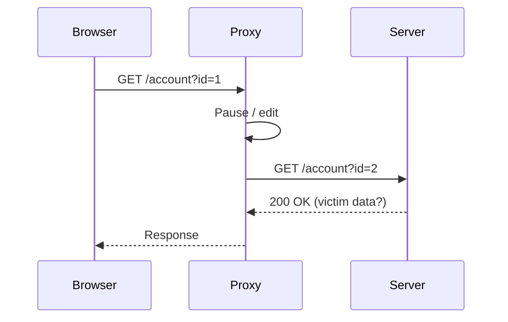

# Lab — Intercepting Traffic

In this lab you will configure an intercepting proxy and modify a live request.

## Objectives

1. Route browser traffic through a proxy.
2. Capture a request.
3. Modify a parameter and forward it.

## Steps

- Set your browser proxy to `127.0.0.1:8080`.
- Enable interception.
- Change `id=1` to `id=2` and forward.
- Record the response.

When you observe another user's data, you have found a **broken access
control** issue.
